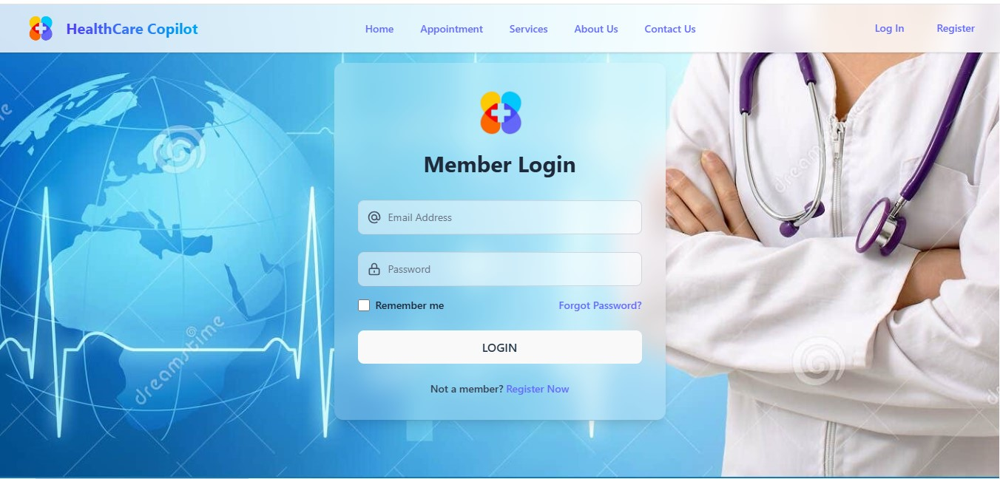
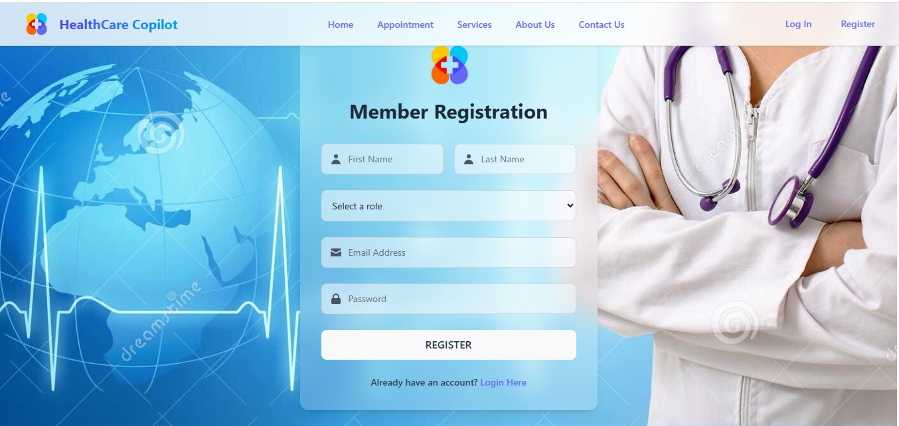
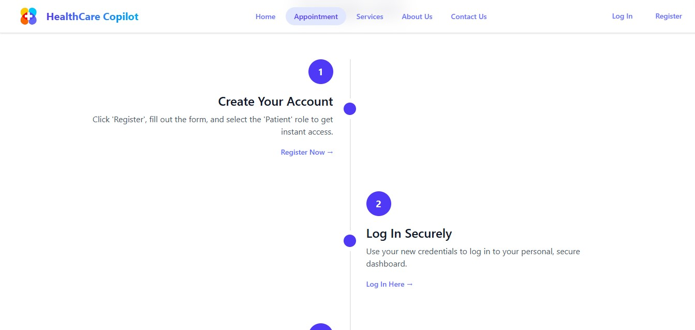
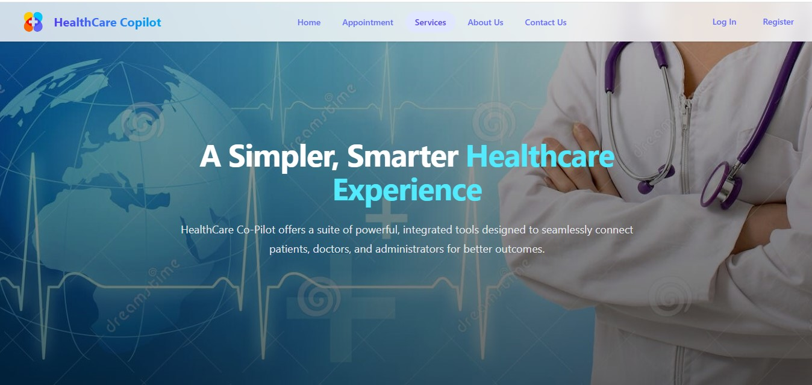

# 🏥 Smart Healthcare System — Frontend

> A production-grade, full stack healthcare web application built with **React 19 + Vite** on the frontend and **Spring Boot 3 + Spring Security + MySQL** on the backend. Designed to demonstrate end-to-end Java Full Stack development capabilities — from JWT-secured REST APIs to a responsive, role-based React UI.

**🔗 Backend Repository:** [HealthCare-Backend](https://github.com/ankitdoi-coder/HealthCare-Backend) — Spring Boot 3 | Spring Security | JPA/Hibernate | MySQL | JWT | OAuth2

---

## 🧑‍💻 What This Project Demonstrates (Java Full Stack Perspective)

> As a Java Full Stack Developer, this project showcases ownership of the **entire vertical slice** — from database schema design to REST API development to a fully functional React UI.

| Layer | Technology | What Was Built |
|---|---|---|
| **Backend** | Spring Boot 3 | RESTful APIs with full CRUD for Patients, Doctors, Appointments, Prescriptions |
| **Security** | Spring Security + JWT | Stateless auth, role-based access control (PATIENT / DOCTOR / ADMIN) |
| **OAuth2** | Google OAuth2 + Spring Security | Social login with token redirect handling on the frontend |
| **Database** | MySQL + JPA/Hibernate | Normalized relational schema, entity relationships, lazy loading |
| **API Docs** | SpringDoc OpenAPI / Swagger UI | Self-documenting REST API at `/swagger-ui/index.html` |
| **Frontend** | React 19 + Vite | Component-based SPA consuming all backend APIs |
| **State** | Redux Toolkit | Centralized store: auth, appointments, doctors, patients, prescriptions |
| **HTTP Layer** | Axios + Interceptors | Auto JWT injection, 401/403 handling, token refresh detection |
| **Routing** | React Router v7 | Role-protected routes, redirect-after-login, 404/401 handling |
| **Forms** | React Hook Form | Validated forms for login, register, appointments, prescriptions |
| **UX** | Tailwind CSS v4 + Framer Motion | Responsive UI with smooth animations |

---

## ✨ Features

### 🔐 Authentication & Security
- **JWT-based stateless login** — credentials sent to `/api/auth/login`, token decoded client-side for role & expiry
- **Google OAuth2 Social Login** — Spring Security OAuth2 flow with a dedicated `OAuth2RedirectHandler` on the frontend
- **Forgot Password / Reset Password** — token-based email reset flow (`/api/auth/forgot-password`, `/api/auth/reset-password`)
- **JWT Expiry Monitoring** — background monitor warns user 5 minutes before session expiry and auto-redirects
- **Axios Request Interceptor** — automatically attaches `Authorization: Bearer <token>` to every API call
- **Axios Response Interceptor** — handles 401 (session expired) with redirect-to-login and 403 (forbidden) gracefully
- **ProtectedRoute Component** — guards all dashboard routes; redirects unauthenticated users, blocks wrong roles

### 🧑‍⚕️ Patient Portal
- Dashboard with personal profile and upcoming appointment summary
- Browse and search doctors by specialty or name
- Book new appointments from available time slots
- View full appointment history with status (SCHEDULED / COMPLETED / CANCELLED)
- Access prescriptions linked to completed appointments
- Profile picture upload and profile settings management

### 👨‍⚕️ Doctor Portal
- Dashboard showing today's appointment schedule
- Access patient records for completed consultations
- Create and issue prescriptions after consultations

### 🔧 Admin Portal
- View all registered doctors including those with pending approval
- Approve new doctor registrations to grant system access
- View and manage all registered patients

### 🌐 Public Landing Pages
- Home, About Us, Services, Appointment Info, Contact Us
- Responsive Navbar and Footer
- Animated UI with Framer Motion

---

## 🏛️ Architecture

```
src/
├── API/                    # Axios instance & config (baseURL from .env)
├── Services/               # Service layer — one file per domain
│   ├── AuthService.js      # JWT decode, token management, axios interceptors
│   ├── PatientService.js   
│   ├── DoctorService.js    
│   ├── AdminService.js     
│   └── ProfileService.js   
├── store/                  # Redux Toolkit store
│   ├── slices/             # authSlice, appointmentsSlice, doctorsSlice, patientsSlice, prescriptionsSlice
│   ├── thunks/             # Async thunks for API calls
│   └── selectors/          # Memoized selectors
├── Components/
│   ├── DashBoards/         # PatientDashboard, DoctorDashboard, AdminDashboard, ProtectedRoute
│   ├── Landing_Pages_Components/   # Home, Login, Register, ForgotPassword, ResetPassword, OAuth2RedirectHandler
│   └── Patient SubComponent/       # AppointmentHistory, DoctorsList, NewAppointment
└── App.jsx                 # Router config with role-based protected routes
```

**Key architectural decisions:**
- **Service Layer Pattern** — mirrors the backend `@Service` layer; each domain has its own service file wrapping Axios calls
- **Redux Slices** — separate slices per entity, matching backend entity structure (Appointment, Doctor, Patient, Prescription)
- **Thunks for Async** — all API calls live in thunks, keeping components clean and testable
- **ProtectedRoute HOC** — declarative route guarding with `allowedRoles` prop, mirrors Spring Security's `@PreAuthorize`

---

## 💻 Tech Stack

| | Technology | Version |
|---|---|---|
| Frontend Framework | React | 19.x |
| Build Tool | Vite | 7.x |
| Routing | React Router DOM | 7.x |
| State Management | Redux Toolkit + React Redux | 2.x / 9.x |
| HTTP Client | Axios | 1.x |
| Styling | Tailwind CSS | 4.x |
| Animations | Framer Motion | 12.x |
| Forms | React Hook Form | 7.x |
| Notifications | Sonner + React Hot Toast | latest |
| Icons | Lucide React + React Icons | latest |
| Backend | Spring Boot 3 | 3.x |
| Security | Spring Security + JWT | stateless |
| Social Auth | OAuth2 (Google) | — |
| ORM | JPA / Hibernate | — |
| Database | MySQL | 8.x |
| API Docs | SpringDoc OpenAPI / Swagger | — |

---

## 🔑 Security Implementation

```
Client                          Server
  │                               │
  │── POST /api/auth/login ───────►│ Spring Security AuthenticationManager
  │◄── { token: "eyJ..." } ───────│ JwtTokenProvider generates token
  │                               │
  │  saveToken(token) → localStorage
  │  decode payload → role, email, exp
  │  dispatch(setAuth({ user, token, role }))
  │                               │
  │── GET /api/patient/appointments ►│
  │   Authorization: Bearer eyJ...  │ JwtAuthFilter validates token
  │◄── [ appointments ] ───────────│ @PreAuthorize("ROLE_PATIENT")
```

- Token expiry is checked client-side on every protected route render
- A `TokenSyncProvider` component keeps Redux auth state in sync with localStorage on page refresh
- OAuth2 Google login redirects to `/oauth2/redirect?token=...` — the `OAuth2RedirectHandler` extracts and stores the token, then dispatches to Redux and routes to the correct dashboard

---

## 🗄️ Database Schema

The backend uses a normalized relational schema with JPA entity relationships.


---

## 🖼️ UI Screenshots

| Page | Preview |
|---|---|
| Home |  |
| Login |  |
| Register |  |
| Appointment |  |
| About Us |  |
| Services |  |

---

## 🚀 Getting Started

### Prerequisites
- Node.js v18+
- Java JDK 17+
- Maven 3.x
- MySQL 8.x

### 1. Start the Backend

```bash
git clone https://github.com/ankitdoi-coder/HealthCare-Backend.git
cd HealthCare-Backend
# Configure application.properties with your MySQL credentials
mvn spring-boot:run
# Runs at http://localhost:8080
# Swagger UI: http://localhost:8080/swagger-ui/index.html
```

### 2. Start the Frontend

```bash
git clone https://github.com/ankitdoi-coder/HealthCare-Frontend.git
cd HealthCare-Frontend
npm install
npm run dev
# Runs at http://localhost:5173
```

### 3. Environment Variables

Create `.env.local` if your backend runs on a different URL:

```env
VITE_API_BASE_URL=http://localhost:8080
```

---

## 📖 API Documentation

All backend endpoints are documented and explorable via Swagger UI:

```
http://localhost:8080/swagger-ui/index.html
```

Covers: Auth, Patient, Doctor, Admin, Appointment, Prescription endpoints with request/response schemas.

---

## 🗂️ Wireframes & Design

The UI was designed before development using Figma wireframes available in `WireFrames & Figma UI's/`:

- Login & Register flows
- Patient, Doctor, Admin panel layouts
- Full system workflow diagram

---

## 👨‍💻 Author

**Ankit** — Java Full Stack Developer

- Built and owned the complete stack: Spring Boot backend + React frontend
- Implemented end-to-end features: JWT auth, OAuth2 Google login, role-based access, full CRUD APIs, relational DB schema
- Followed industry patterns: Service Layer, Repository Pattern, Redux Thunks, Protected Routes, Axios Interceptors

> 📬 Open to Java Full Stack / Backend / Frontend opportunities. Feel free to connect!
